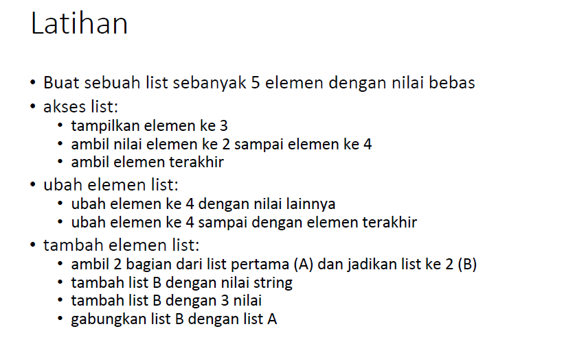
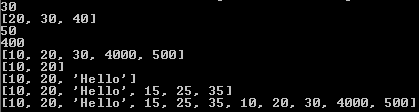
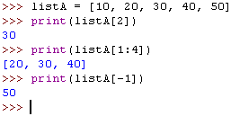
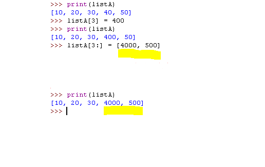
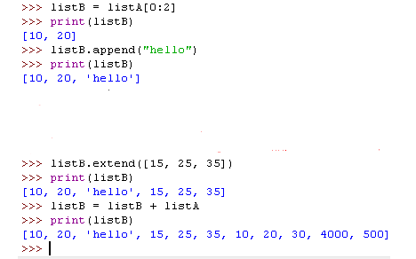
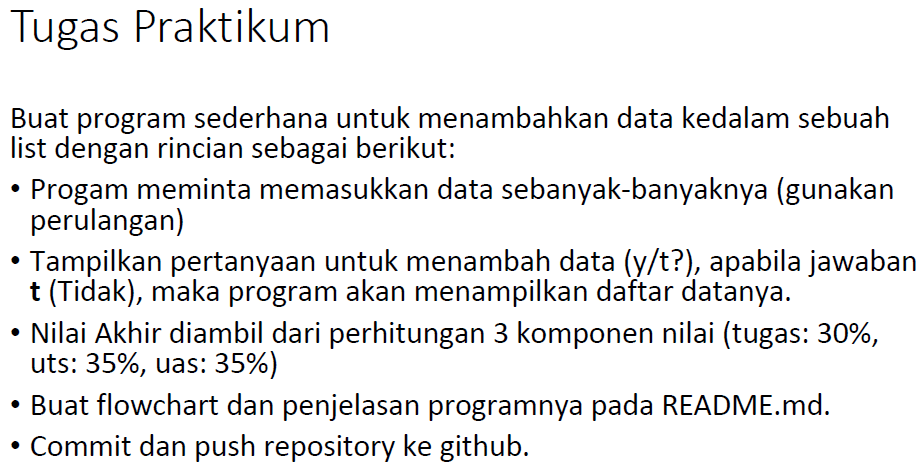
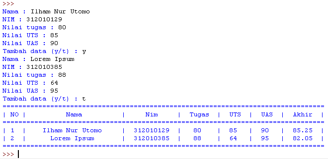

# DAFTAR TUGAS

<table border="2" cellpading="10">
  <tr>
    <td><b>Pertemuan 4</b></td>
    <td>Latihan VCS</td>
    <td><a href="https://github.com/IlhamLamp/LatihanVCS">Klik disini</td>
  </tr>
  <tr>
    <td><b>Pertemuan 5</b></td>
    <td>Program Biodata</td>
    <td><a href="https://github.com/IlhamLamp/Program-menginputkan-biodata">Klik disini</td>
  </tr>
  <tr>
    <td><b>Pertemuan 6</b></td>
    <td>Lab1 dan 2</td>
    <td><a href="https://github.com/IlhamLamp/ProjectPraktikum">Klik disini</td>
  </tr>
  <tr>
    <td><b>Pertemuan 7</b></td>
    <td>Lab3</td>
    <td><a href="https://github.com/IlhamLamp/Lab3">Klik disini</td>
  </tr>
  <tr>
    <td></td>
    <td>Labspy02</td>
    <td><a href="https://github.com/IlhamLamp/labspy02">Klik disini</td>
  </tr>
  <tr>
    <td></td>
    <td>Labpy03</td>
    <td><a href="https://github.com/IlhamLamp/labpy03">Klik disini</td>
  </tr>
  <tr>
    <td><b>Pertemuan 9</b></td>
    <td>Lab 4</td>
    <td><a href="https://github.com/IlhamLamp/Lab-4">Klik disini</td>
  </tr>
  <tr>
    <td></td>
    <td>Lab 5</td>
    <td><a href="https://github.com/IlhamLamp/Lab-5">Klik disini</td>
  </tr>
</table>

# LAB 4
## Latihan
  

### Jawab
  - Salin kode berikut ke text editor ataupun langsung di Python shell.

        1     listA = [10, 20, 30, 40, 50]
        2     print(listA[2])
        3     print(listA[1:4])
        4     print(listA[-1])
        5  
        6     listA[3] = 400
        7     print(listA[3])
        8     listA[3:] = [4000, 500]
        9     print(listA)
        10
        11    listB = listA[0:2]
        12    print(listB)
        13    listB.append('Hello')
        14    print(listB)
        15    listB.extend([15, 25, 35])
        16    print(listB)  
        17    listB = listB + listA
        18    print(listB)  

  - Simpan dengan nama `latihan.py` kemudian jalankan program. Maka akan menampilkan output sebagai berikut
  
  - **_Akses List_**

  
  - **_Ubah elemen list_**

  
  - **_Tambah elemen list_**

  

## Tugas Praktikum
### Soal
  

### Jawab
  - Salin kode berikut ke text editor.

        1   lists = []
        2   hitung = 1
        3
        4   while(True):
        5       nama = input("Nama : ")
        6       induk = input("NIM : ")
        7       latihan = input("Nilai tugas : ")
        8       exam1 = input("Nilai UTS : ")
        9       exam2 = input("Nilai UAS : ")
        10      akhir = (int(latihan)*30/100) + (int(exam1)*35/100) + (int(exam2)*35/100)
        11
        12      tampung = []
        13      tampung.extend([hitung, nama, induk, latihan, exam1, exam2, akhir])
        14      lists.append(tampung)
        15
        16      hitung += 1
        17      tanya = input("Tambah data (y/t) : ")
        18      if (tanya=='t'):
        19          break
        20
        21      print('=' * 81)
        22      print("| NO |          Nama          |     Nim     |  Tugas  |  UTS  |  UAS  |  Akhir  |")
        23      print('=' * 81)
        24      for item in lists:
        25          print("|",'{:^2d}'.format(item[0]),"|"
        26                ,'{:^22}'.format(item[1]),"|"
        27                ,'{:^11}'.format(item[2]),"|"
        28                ,'{:^7}'.format(item[3]),"|"
        29                ,'{:^5}'.format(item[4]),"|"
        30                ,'{:^5}'.format(item[5]),"|"
        31                ,'{:^7.2f}'.format(float(item[6])),"|"
        32               )
        33      print('=' * 81)

  - Simpan dengan nama `lab4.py` kemudian jalankan program. Maka akan menampilkan output sebagai berikut
  

### Penjelasan
  - Di baris **ke-1** dan **2** mendeklarasikan variabel ``lists`` yang akan menyimpan list nantinya. `hitung = 1`menyimpan variabel hitung yang bernilai 1.

  - Baris **ke-4** `While(True)`sebagai perulangan, kode/ baris program yang dibawahnya akan terus berulang sampai program diberhentikan.

  - Baris **ke-5** sampai **9** terdapat `input`, agar user dapat memasukan _`Nama, NIM, Nilai Tugas, UTS, dan UAS`_. Kemudian di baris **10**, variabel `akhir` akan menjumlahkan `nilai tugas, uts, dan uas` yang user masukkan lalu dibagi tiga(3).

  - Baris **12** membuat list baru, variabel `tampung`.

  - Baris **13** akan menambahkan _`Nama, NIM, Nilai Tugas, UTS, dan UAS`_ yang telah user masukkan tadi, ke variabel `tampung`.

  - Di baris **14**, variabel `tampung` tadi, akan di-oper/ di pindahkan ke variabel `lists` yang ada di baris **1**. Nilai hitung akan bertambah 1. (baris **16**)

  - Membuat variabel `tanya` (baris **17**), jika user memasukkan huruf `t`. Maka program akan berhenti / _break_ dan program akan berlanjut ke baris **Selanjutnya**. Tapi jika user memasukkan huruf `y` atau huruf selain `t`, maka program akan terus berulang dari baris **ke-5** sampai **16**.

  - Tanda sama dengan yang berjumlah 81 akan di tampilkan di layar (Baris **ke-21, 23** dan **33**)

  - Menampilkan ke layar `No | Nama | ...` dan seterusnya.(Baris ke**22**)

  - Baris **24**, `for` akan melakukan perulangan pada variabel `lists`

  - Baris **25** sampai **32** akan mencetak kelayar sesuai jumlah list yang dimasukkan pada variabel `lists` dan sesuai format yang telah ditulis. Kode `'{:^22}'` akan membuat nilai pada `format(item[1])` ruas kanan dan kiri menjadi 22 karakter. Sedangkan `2.f` akan memotong nilai `float` yang mempunyai banyak koma dibelakangnya, menjadi **2** angka di belakang koma.
